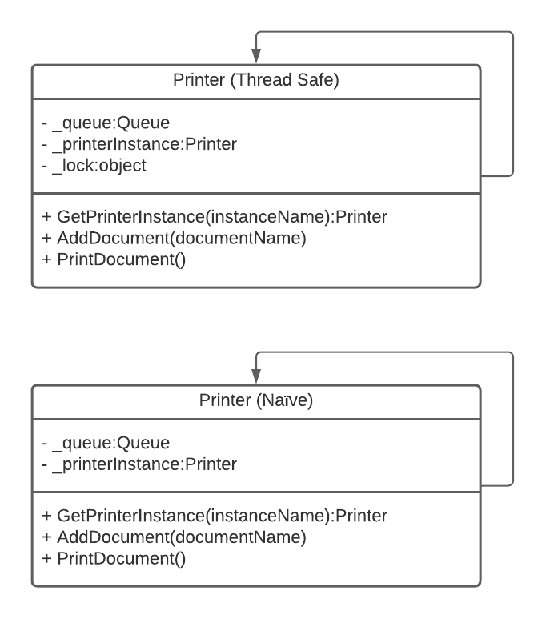

# Singleton Design Pattern
Singleton is a creational design pattern that lets you ensure that a class has only one instance, while providing a global access point to this instance.

In this example solution, we using a shared resource a printer. In a real world example this could be an exteral driver. We need to ensure that anytime anywhere in our code that we add to the printer queue and then print a doument that the same printer instance is being used.

For more information about the Singleton Pattern you can read up on it [here](https://refactoring.guru/design-patterns/singleton).

# UML Diagram of Printer Example
